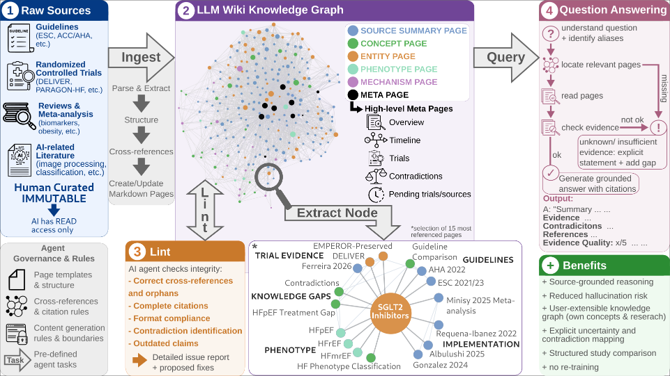

## LLM Wiki for HFpEF

A structured, LLM-native knowledge graph for heart failure with preserved ejection fraction (HFpEF),
inspired by Andrej Karpathy's "LLM Wiki" paradigm <a target="_blank" href="https://gist.github.com/karpathy/442a6bf555914893e9891c11519de94f">Andrej Karpathy's "LLM Wiki"</a>.
This repository encodes HFpEF as an interconnected system of concepts rather than a linear narrative, enabling precise navigation across pathophysiology, clinical phenotypes, and evolving guideline logic.

### Motivation

LLMs enable flexible question answering and can summarize and connect large amounts of information. 
But plausible-sounding answers are not necessarily verified knowledge. 
They can include factual inaccuracies, overgeneralizations, fabricated information, inconsistent instructions, or hallucinated citations. 
They may also cite a real paper that does not actually support the claim being made, making it difficult to distinguish reliable evidence from plausible-sounding information.

This becomes particularly important in clinical and research settings, where it is crucial that the knowledge behind an answer is correct, up to date, and supported by appropriate evidence.

For scientific questions, we need more than a confident answer. We need to know:

    Where does the information come from?
    Which study, trial, or guideline supports the claim?
    Is the evidence recent and reliable?
    Are there conflicting findings?
    Can the information be traced back to the original source?

That's where the LLM Wiki comes in.

### The idea

The key idea is that the LLM incrementally builds and maintains a persistent wiki, while the user's tasks mainly involve sourcing, exploration and questions.
Unlike a typical RAG pipeline, the knowledge base is a structured, human-curated, versioned graph. Every fact traces back to a reviewed source.

The rough structure contains three main components:

- Raw sources: A collection of human-curated source documents, such as guidelines, randomized controlled trials, reviews & meta-analyses and AI-related literature. The AI has explicit read-only access to it.
- The wiki: From these source files, the LLM generates the actual wiki as Markdown files containing the source information. These files are interlinked, forming a closely connected knowledge graph.
- The schema: A set of Markdown files that tells the LLM how the wiki is structured and what conventions to follow. It defines rules and boundaries for content generation, provides explicit structures and templates, and specifies how concepts, citations, evidence, and tasks should be handled.

LLM-native wiki knowledge graphs (KGs) enable transparent, source-linked reasoning, preserving provenance,
representing conflicting evidence, and preventing hallucinations through curated, traceable
knowledge nodes. Future refinement could include a revision of task definitions, templates, and
evidence grading. The modular architecture further enables integration of novel concepts,
unpublished data, and emerging evidence without retraining. LLM KGs offer an interpretable
foundation for evidence synthesis, mechanistic exploration, and up-to-date clinical decision
support, also extensible to other clinical domains.

### How to use it

The wiki is subdivided into concepts, entities, sources, queries, summaries, and comparisons.
HTML pages and machine-readable graph representations are generated from the wiki files.

Our main schema document (CLAUDE.md) is written for Claude. You would have to adapt it if you want to use a different LLM. It contains the main terms, structure, rules, and tasks.

Each topic gets one page. Before creating new content, the LLM should search for existing pages with the same meaning. If it finds a sufficiently similar page, it should update the existing page and add the new name as an alias.

It should also never guess or fill in medical facts from memory. The main rules are that medical facts must be sourced, disagreements must be recorded, and nothing should ever be guessed or fabricated.

The three main operations you can perform are:

#### Ingest
Add a new source, and the LLM integrates its relevant information into the existing wiki. The LLM discusses the analysis with the user before writing anything.
It writes a summary page, updates the index, updates relevant entity and concept pages, and appends an entry to the log.
The log is a chronological, append-only record of what happened and when. It will be created with the first Ingest.
#### Query
Ask questions against the wiki and receive answers with citations based on the available knowledge and its interconnections.
There are different answer modes. By default, the Standard mode is selected, but depending on how detailed you want your answer to be, 
you can ask for a different mode (TL;DR, Short, Extended).
#### Lint
A periodic health check for the wiki. It helps identify contradictions, stale claims, orphaned pages, and other issues that need attention.
The LLM is only allowed to identify and report issues with a suggested fix. It is not allowed to apply fixes itself.

### Folder structure

    _config/       integration configs (Zotero API credentials)
    _tasks/        Executable workflows for wiki operations
    _templates/    page templates: source, study, concept, entity

    inbox/         unprocessed notes — Claude helps triage
    raw/           Source documents — never modified

    wiki/          Canonical knowledge base
        sources/       Source-specific summaries
        entities/      Named entities such as trials, drugs, biomarkers, and guidelines
        concepts/      Mechanisms, relationships, and diagnostic criteria
        queries/       Saved questions and answers
        summaries/     Topic summaries
        comparisons/   Structured comparisons
        *.md           Indexes, timelines, trial lists, citations 

    graph/         Machine-readable knowledge graph derived from the wiki
        entities.json
        aliases.json
        relations.json
        derivations.json

    html/          Generated static representation of the wiki

### Navigating the wiki

- wiki/index.md — catalog of the knowledge base. Each page listed with a link.
- wiki/overview.md — high-level overview, active debates, and knowledge gaps 
- wiki/timeline.md — evolution of HFpEF understanding 
- wiki/trials.md — clinical trial overview 
- wiki/citations.md — citation registry
- wiki/contradictions.md — documented tensions between sources and knowledge pages

If you have any questions, ideas, or resources that are missing, feel free to leave a comment in the
[GitHub Discussion](https://github.com/Cardio-AI/llm-kg-wiki-hfpef/discussions/1)

This repository was designed for the ESC Digital & AI Summit 2026 as part of the
[Multi-dimensionAI project](https://www.carl-zeiss-stiftung.de/uebersicht-projekte/detail/multi-dimensionai-linking-scales-of-information-to-improve-care-for-patients-with-heart-failure), *Linking scales of information to improve care for patients with heart failure*.

For reference, the first final version submitted for the ESC is preserved in commit 4d11b3, dated May 20, 2026.
